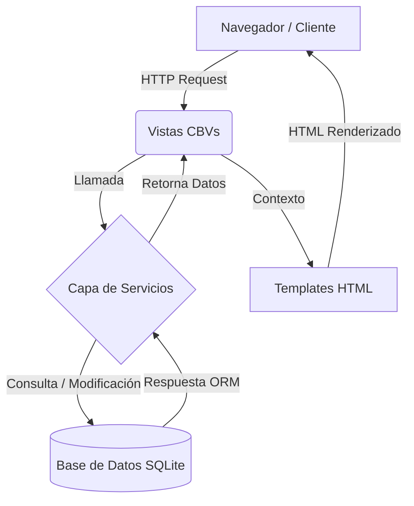

# FleetPro 🚛


FleetPro es un sistema de gestión de flotillas vehiculares desarrollado en Python y Django. Su arquitectura está orientada a la mantenibilidad, escalando desde un monolito tradicional hacia un diseño con separación de responsabilidades a través de una **Capa de Servicios** y **Control de Acceso Basado en Roles (RBAC)**.

## 🏗️ Arquitectura del Sistema

El proyecto implementa un flujo unidireccional que aísla la lógica de negocio de las vistas, mejorando la seguridad y la testeabilidad.



## 🛠️ Tecnologías Principales
- **Backend:** Python 3.12+ y Django 6.0+
- **Gestión de Entornos:** `uv` (extremadamente rápido)
- **Calidad de Código:** `ruff` (Linter & Formatter PEP8)
- **Base de Datos:** SQLite3 (por defecto)
- **Frontend:** Bootstrap 5.3, Vanilla JS, Chart.js
- **Testing y CI/CD:** `pytest`, `pytest-django` y GitHub Actions

## 🚀 Instalación y Configuración Local

Este proyecto utiliza `uv` para gestionar dependencias de manera determinista y rápida.

1. **Clonar el repositorio:**
   ```bash
   git clone https://github.com/PedroSL0904/fleet-management-system.git
   cd fleet-management-system
   ```

2. **Configurar Variables de Entorno:**
   Crea tu propio archivo `.env` basándote en la plantilla proporcionada:
   ```bash
   cp .env.example .env
   ```
   *Nota: Asegúrate de rellenar los datos en el archivo `.env`, especialmente la llave `SECRET_KEY`.*

3. **Instalar Dependencias e inicializar el entorno:**
   ```bash
   uv sync
   ```

4. **Aplicar Migraciones y Levantar el Servidor:**
   ```bash
   uv run python manage.py migrate
   uv run python manage.py runserver
   ```

## 🧪 Pruebas (Testing)
Toda la lógica de negocio (Servicios) y reglas de acceso (RBAC) está cubierta por pruebas automatizadas en CI/CD. Para ejecutarlas localmente:

```bash
uv run pytest
```

## 🔐 Control de Acceso (RBAC)
El sistema divide a los usuarios en tres roles (perfiles) principales:
- **Administrador:** Control total sobre vehículos, choferes, asignaciones y mantenimientos.
- **Mecánico:** Permisos limitados; enfoque en la revisión y cierre de mantenimientos vehiculares.
- **Chofer:** Acceso de sólo lectura/visualización para el dashboard y sus asignaciones correspondientes.

---
*Desarrollado y refactorizado con buenas prácticas de Ingeniería de Software.*
